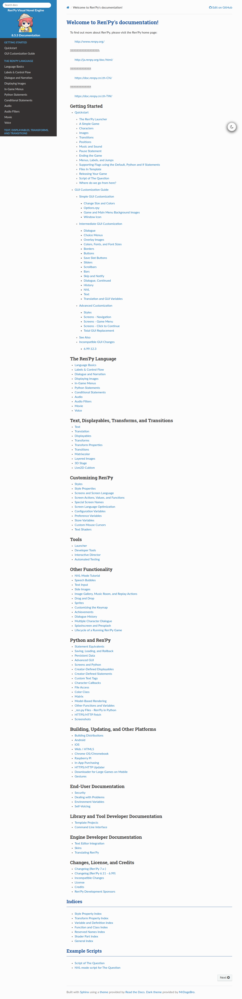

# Visited: https://www.renpy.org/doc/html/index.html
**Time:** Sun May 10 13:04:13 UTC 2026

## Screenshot

## Raw HTML
[page.html](./page.html)

## Downloaded Media (0 files)
_No media files downloaded_

## Other Links
- [#](#)
- [#example-scripts](#example-scripts)
- [#indices](#indices)
- [#welcome-to-ren-py-s-documentation](#welcome-to-ren-py-s-documentation)
- [3dstage.html](3dstage.html)
- [_static/_sphinx_javascript_frameworks_compat.js?v=2cd50e6c](_static/_sphinx_javascript_frameworks_compat.js?v=2cd50e6c)
- [_static/css/theme.css?v=9edc463e](_static/css/theme.css?v=9edc463e)
- [_static/custom.css?v=6eda34c5](_static/custom.css?v=6eda34c5)
- [_static/dark_mode_css/dark.css?v=70edf1c7](_static/dark_mode_css/dark.css?v=70edf1c7)
- [_static/dark_mode_css/general.css?v=c0a7eb24](_static/dark_mode_css/general.css?v=c0a7eb24)
- [_static/dark_mode_js/default_light.js?v=c2e647ce](_static/dark_mode_js/default_light.js?v=c2e647ce)
- [_static/dark_mode_js/theme_switcher.js?v=358d3910](_static/dark_mode_js/theme_switcher.js?v=358d3910)
- [_static/doctools.js?v=fd6eb6e6](_static/doctools.js?v=fd6eb6e6)
- [_static/documentation_options.js?v=190cfd85](_static/documentation_options.js?v=190cfd85)
- [_static/jquery.js?v=5d32c60e](_static/jquery.js?v=5d32c60e)
- [_static/js/theme.js](_static/js/theme.js)
- [_static/pygments.css?v=b86133f3](_static/pygments.css?v=b86133f3)
- [_static/sphinx_highlight.js?v=6ffebe34](_static/sphinx_highlight.js?v=6ffebe34)
- [achievement.html](achievement.html)
- [android.html](android.html)
- [audio.html](audio.html)
- [audio_filters.html](audio_filters.html)
- [bubble.html](bubble.html)
- [build.html](build.html)
- [cdd.html](cdd.html)
- [cds.html](cds.html)
- [changelog.html](changelog.html)
- [changelog6.html](changelog6.html)
- [character_callbacks.html](character_callbacks.html)
- [chromeos.html](chromeos.html)
- [cli.html](cli.html)
- [color_class.html](color_class.html)
- [conditional.html](conditional.html)
- [config.html](config.html)
- [credits.html](credits.html)
- [custom_text_tags.html](custom_text_tags.html)
- [developer_tools.html](developer_tools.html)
- [dialogue.html](dialogue.html)
- [director.html](director.html)
- [displayables.html](displayables.html)
- [displaying_images.html](displaying_images.html)
- [downloader.html](downloader.html)
- [drag_drop.html](drag_drop.html)
- [editor.html](editor.html)
- [environment_variables.html](environment_variables.html)
- [fetch.html](fetch.html)
- [file_python.html](file_python.html)
- [genindex.html](genindex.html)
- [gesture.html](gesture.html)
- [gui.html](gui.html)

## Stats
- Links: 177
- Media: 0
